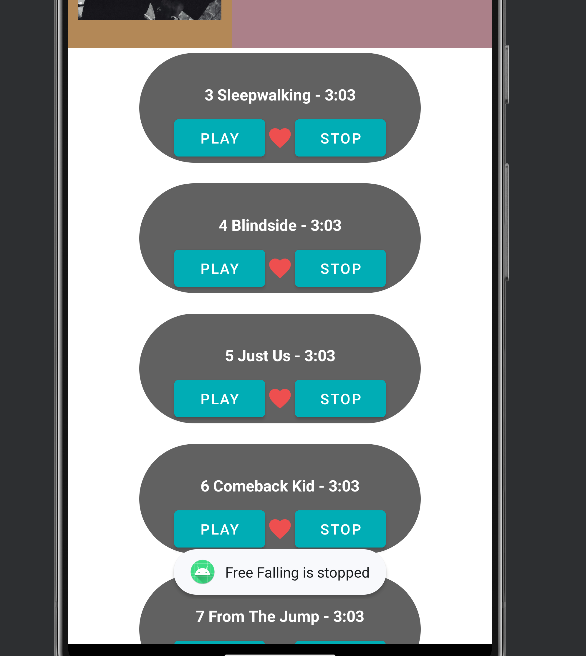

# Spotify Simple Clone Project

## Overview

This project is a simplified clone of the popular music streaming service Spotify. Leveraging the Spotify API, the application allows users to interact with basic functionalities such as playing and stopping demo songs, adding tracks to favorites, and exploring a demo list of songs. Developed using Android Studio, the project is implemented in Java, utilizing the Spotify Java SDK.

## Features

- **Play/Stop Demo Song:** Users can experience the music playback functionality by playing and stopping demo songs available through the Spotify API.

- **Add to Favorites:** Enhance the user experience by allowing them to mark their favorite tracks and create a personalized list.

- **Explore Demo Song List:** Discover a curated list of demo songs to showcase the application's capabilities.

## Technologies Used

- **Android Studio:** The project is developed in Android Studio, a popular integrated development environment (IDE) for Android app development.

- **Java:** The primary programming language used for the implementation of the application.

- **Spotify API:** Integration with the Spotify API enables seamless access to music data and playback features.

- **Spotify Java SDK:** The SDK provides a set of tools and libraries to simplify the interaction with the Spotify API in the Java programming language.

## How to Run

1. **Clone the Repository:** Begin by cloning the project repository from [GitHub Link].

2. **Setup Spotify API Credentials:** Obtain the necessary API credentials from the Spotify Developer Dashboard and configure them in the application.

3. **Build and Run:** Open the project in Android Studio, build the application, and run it on an Android emulator or device.

4. **Explore and Enjoy:** Navigate through the demo song list, play and stop songs, and add tracks to your favorites to make the most of the Spotify Simple Clone experience.

Feel free to customize and expand upon the project to add more features or tailor it to your specific requirements.

### Demo

